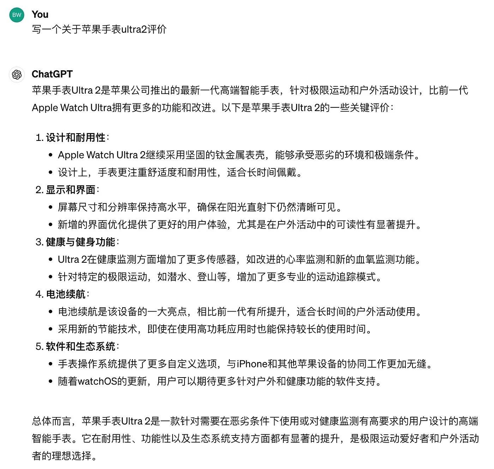
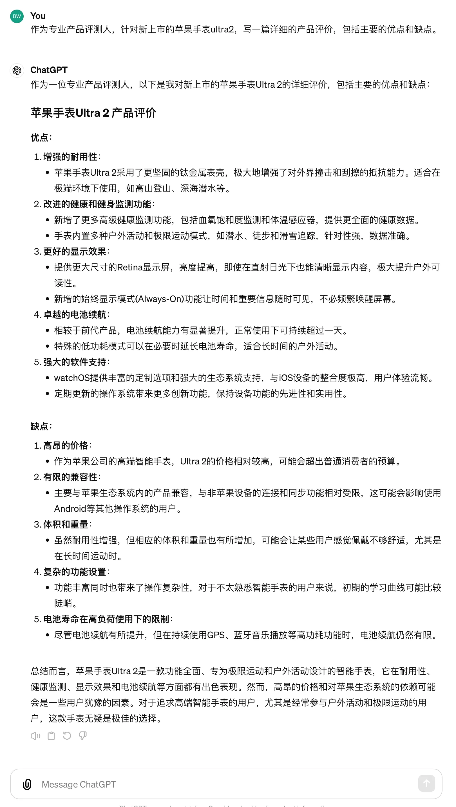
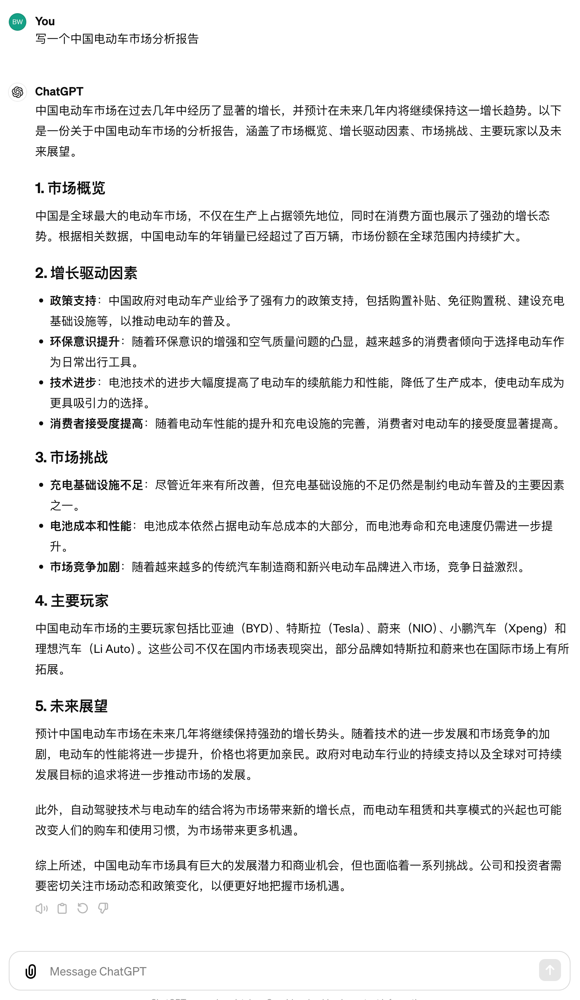
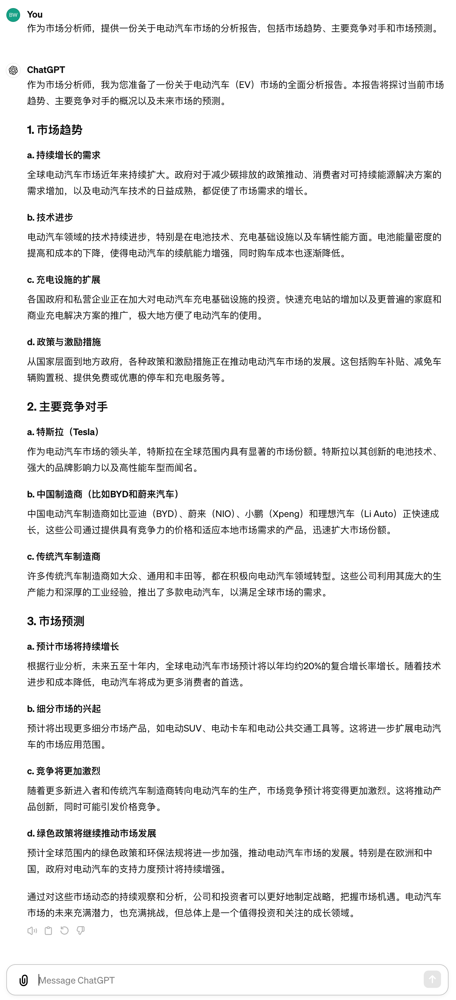

# COSTAR：激活ChatGPT的最佳表现

在人工智能领域，尤其是在与语言模型如ChatGPT的互动中，用户常常面临如何有效地传达需求和期望的挑战。

COSTAR框架提供了一种系统化的方法来构建高效的交互提示词，以优化AI的回答质量和相关性。

COSTAR代表五个关键元素：

* Context（上下文）
* Objective（目标）
* Style（风格）
* Tone（语气）
*Role（角色）。

通过明确这五个方面，用户能够减少误解和不精确的交互，从而显著提高AI交互的效果。

## 示例与对比

### 例子1：产品评价请求

**未使用COSTAR**
> 提示词： “写一个关于苹果手表ultra2评价。”

分析： 输出简单，没有提供具体信息，无法满足需要深入分析的读者。

**使用COSTAR**

Context： 新上市的苹果智能手表ultra2

Objective： 提供详细的产品优缺点评价

Style： 信息性和批判性

Tone： 客观公正

Role： 专业产品评测人

> 提示词： “作为专业产品评测人，针对新上市的苹果手表ultra2，写一篇详细的产品评价，包括主要的优点和缺点。”

分析： 输出具体且信息丰富，更符合读者期待。

### 例子2：撰写市场分析报告

**未使用COSTAR**

> 提示词： “写一个中国电动车市场分析报告”

分析： 过于简略，缺乏深度和实用性。

**使用COSTAR**

Context： 针对电动汽车市场

Objective： 分析市场趋势和竞争对手

Style： 分析性和详尽

Tone： 客观严谨

Role： 市场分析师

> 提示词： “作为市场分析师，提供一份关于电动汽车市场的分析报告，包括市场趋势、主要竞争对手和市场预测。”

分析： 报告详细且具有前瞻性，能够为决策者提供实用信息。

## 总结
COSTAR框架通过系统化地构建提示词，显著提高了与ChatGPT的交互质量。

它帮助用户明确交互的上下文、目标、风格、语气和角色，从而生成更为精准和高质量的输出。

无论是写作、市场分析还是日常咨询，COSTAR都是提高AI交互效率和效果的强大工具。

#COSTAR框架 #ChatGPT #人工智能 #AI交互 #智能写作 #市场分析 #技术写作 #求职信 #产品评价 #AI教育 #COSTARFramework #ChatGPT #ArtificialIntelligence #AIInteraction #ContentCreation #MarketAnalysis #TechnicalWriting #CoverLetter #ProductReview #AIeducation
