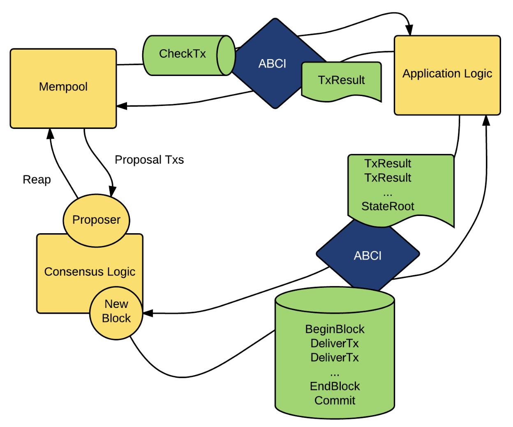

# 基于ABCI的区块链节点如何处理交易并产生新的区块

## ABCI
ABCI是Application BlockChain Interface的缩写，是Tendermint区块链的核心设计之一。ABCI定义了区块链节点和应用程序之间的接口，使得应用程序可以独立于区块链节点运行。ABCI的设计使得Tendermint区块链的节点可以通过不同的应用程序来实现不同的功能，而不需要修改节点的代码。

## ABCI的工作流程
1. **交易提交到Mempool**：当用户发起一个交易时，这个交易会首先被提交到节点的Mempool（内存池）。这里是所有待处理交易的集合地。
 
2. **交易检查CheckTx**：交易在被引入到区块之前，会通过ABCI接口的CheckTx函数进行初步的有效性检查。这个步骤不会改变链上的状态，但会检查交易的合法性，比如格式是否正确、用户的余额是否足够等。
 
3. **提案者Proposer选择交易**：在共识逻辑的一部分，一个被选定的提案者（Proposer）将从Mempool中选择交易，准备打包到新的区块中。这个过程有时候被称为“Reap”。
 
4. **新区块的产生**：提案者提出了一个新的区块，这个区块包括了提案者从Mempool中选出的交易。
 
5. **共识逻辑Consensus Logic**：所有的验证节点将对提案者提出的新区块进行投票。这个过程是为了确保网络中的多数节点同意将此区块加入区块链。
 
5. **应用逻辑Application Logic执行交易**：一旦达成共识，通过ABCI接口，新区块中的每笔交易会被发送给应用逻辑执行。执行的过程包括三个阶段：BeginBlock（区块开始），DeliverTx（交付交易）和EndBlock（区块结束）。
 
7. **交易结果TxResult和状态根StateRoot**：每笔交易执行后，应用逻辑会生成一个或多个交易结果（TxResult），并计算一个新的状态根（StateRoot）。状态根是一个代表当前区块链状态完整性的加密哈希值。
 
8. **提交Commit**：执行完所有交易并生成状态根后，通过ABCI的Commit函数，应用逻辑会将新的状态永久性地写入区块链，完成新区块的产生。

## ABCI的优势
ABCI的设计使得Tendermint区块链的节点可以通过不同的应用程序来实现不同的功能，而不需要修改节点的代码。这种设计的优势在于：

## TLDR
将上述流程串联起来，我们得到一个完整的区块生产流程：

* 用户提交交易到Mempool。
* ABCI的CheckTx函数检查交易。
* 提案者从Mempool中选择交易，并提出新区块。
* 通过共识逻辑，网络中的节点对新区块进行确认。
* 确认的区块交给应用逻辑，依次执行交易。
* 应用逻辑处理交易，返回交易结果，计算状态根。
* 应用逻辑提交最终的区块状态到区块链，完成区块的提交。

ABCI在整个过程中扮演了中间人的角色，它将共识层和应用逻辑层连接起来，确保交易的顺利执行和新区块的正确生成。

#BlockchainWorkflow #ABCIProtocol #TransactionValidation #MempoolProcess #ConsensusMechanism #BlockProposal #TendermintBlockchain #TransactionExecution #StateManagement #CommitFunction

#区块链工作流程 #ABCI协议 #交易验证 #内存池处理 #共识机制 #区块提议 #Tendermint区块链 #交易执行 #状态管理 #提交功能
